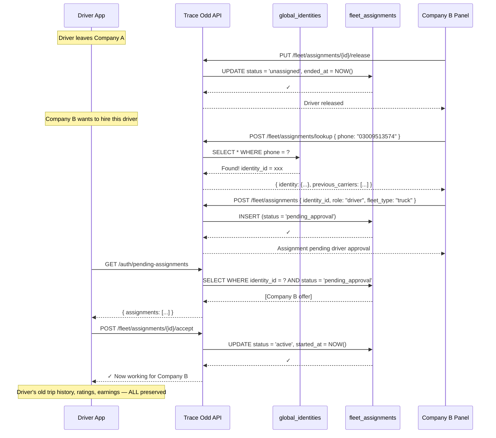
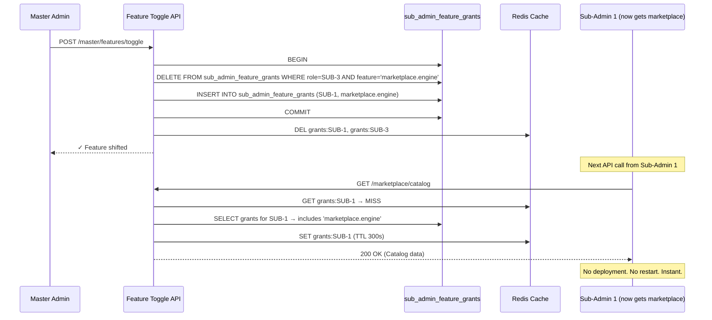
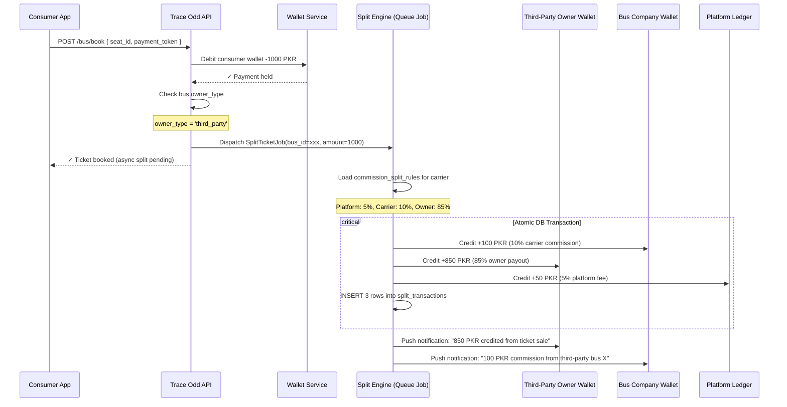

# Trace Odd — Comprehensive Architectural Proposal

## Multi-Tenant Role-Based Sub-Admin Cloud Architecture

**Document Version:** v1.0
**Date:** 2026-06-02
**Reference:** `NEXATRACE_SUPREME_MASTER_SPEC.md`
**Status:** AWAITING REVIEW — No code has been modified. This is a pure architectural proposal.

---

## TABLE OF CONTENTS

1. [Global Identity Repository (The Passport System)](#1-global-identity-repository)
2. [Quad Sub-Admin Hierarchy & Dynamic Feature Toggles](#2-quad-sub-admin-hierarchy)
3. [Cross-Tenant Vendor Allowance Shield](#3-vendor-allowance-shield)
4. [Commission Split Engine (Third-Party Settlement)](#4-commission-split-engine)
5. [Decentralized Seat Layout Drawing Engine](#5-decentralized-seat-layout)
6. [Flutter Application Adaptation Strategy](#6-flutter-application-adaptation)
7. [Database Migration Roadmap (3-Phase)](#7-database-migration-roadmap)
8. [Middleware & Security Architecture](#8-middleware--security)
9. [Sequence Diagrams — Key Workflows](#9-sequence-diagrams)
10. [Summary of Key Architectural Decisions](#10-summary-of-key-architectural-decisions)

---

## 1. GLOBAL IDENTITY REPOSITORY

### 1.1 Core Problem

Currently, drivers, conductors, and owners exist **only** inside the `drivers` table, hard-scoped to `company_id` and `driver_type`. When a driver leaves Company A, their profile, ratings, trip history, and earnings logs are locked to that company's context. There is no portable identity.

### 1.2 Proposed Schema

```
┌─────────────────────────────────────────────────────────────────┐
│                    GLOBAL_IDENTITIES (Passport)                  │
├─────────────────────────────────────────────────────────────────┤
│ id               UUID PRIMARY KEY                               │
│ identity_token   VARCHAR(12) UNIQUE   ← "TRC-9X7K2" anonymized │
│ full_name        VARCHAR(255)                                    │
│ phone            VARCHAR(50) UNIQUE                             │
│ email            VARCHAR(255) UNIQUE NULLABLE                   │
│ cnic             VARCHAR(30) UNIQUE NULLABLE  ← National ID     │
│ identity_type    ENUM('driver','conductor','owner','mixed')     │
│ password_hash    VARCHAR(255)            ← Universal login      │
│ avatar_url       TEXT NULLABLE                                  │
│ metadata         JSONB DEFAULT '{}'      ← Rating, badges, etc  │
│ status           ENUM('active','suspended','deleted')           │
│ created_at       TIMESTAMP                                       │
│ updated_at       TIMESTAMP                                       │
└─────────────────────────────────────────────────────────────────┘
                              │
                              │ 1:N
                              ▼
┌─────────────────────────────────────────────────────────────────┐
│                   FLEET_ASSIGNMENTS (Bindings)                   │
├─────────────────────────────────────────────────────────────────┤
│ id                    UUID PRIMARY KEY                           │
│ global_identity_id    UUID FK → global_identities.id            │
│ carrier_type          ENUM('bus_company','truck_company',       │
│                            'third_party_owner')                  │
│ carrier_id            UUID FK → companies.id (nullable if       │
│                              third_party without host yet)       │
│ role                  ENUM('owner','driver','conductor')        │
│ fleet_type            ENUM('bus','truck')                       │
│ is_third_party        BOOLEAN DEFAULT FALSE                     │
│ parent_carrier_id     UUID NULLABLE  ← If 3rd-party, which      │
│                                         primary company hosts   │
│ status                ENUM('active','suspended','unassigned',   │
│                            'pending_approval')                   │
│ salary                DECIMAL NULLABLE                          │
│ hire_date             DATE NULLABLE                             │
│ license_number        VARCHAR(100) NULLABLE                     │
│ vehicle_plate_number  VARCHAR(50) NULLABLE                       │
│ tenant_allowances     JSONB DEFAULT '{}'  ← Permission mask     │
│ started_at            TIMESTAMP                                  │
│ ended_at              TIMESTAMP NULLABLE                        │
│ created_at            TIMESTAMP                                  │
│ updated_at            TIMESTAMP                                  │
│                                                                  │
│ UNIQUE(global_identity_id, carrier_id, role)                    │
└─────────────────────────────────────────────────────────────────┘
```

### 1.3 Key Design Decisions

| Decision | Rationale |
|---|---|
| **Identity is immortal, assignments expire** | When a driver leaves, `fleet_assignments.status = 'unassigned'` — their identity, ratings, and history survive. A new carrier pulls them by phone/CNIC and creates a fresh binding. |
| **`identity_type = 'mixed'`** | A person can be both a driver AND an owner (e.g., owner-operator). Their single `global_identities` row supports multiple `fleet_assignments` with different roles. |
| **`tenant_allowances` as JSONB** | Avoids exploding the schema with a Cartesian product of permission tables. Each third-party owner defines what their host carrier can see/edit on this assignment. Indexed with GIN for fast queries. |
| **`identity_token` (5-digit anonymized)** | Per spec §10B — a random pseudo-anonymized ID that third-party owners use as their public-facing identifier instead of exposing their real name/email. |

### 1.4 Migration Path from Existing `drivers` Table

```
Phase 1 (non-breaking):
  ├── Create both new tables
  ├── Add nullable global_identity_id FK to existing drivers table
  └── Both old & new queries work simultaneously

Phase 2 (backfill):
  ├── INSERT INTO global_identities SELECT DISTINCT ON (phone, email)
  │     name, phone, email, password, ...
  │     FROM drivers WHERE phone IS NOT NULL
  ├── INSERT INTO fleet_assignments
  │     SELECT drivers.id as old_ref, global_identity_id, role, ...
  │     FROM drivers JOIN global_identities ON ...
  └── Verify counts match

Phase 3 (cutover):
  ├── Login endpoints → check global_identities + active fleet_assignments
  ├── Admin panels → list fleet_assignments instead of drivers
  └── Deprecate drivers table (keep as archived view)
```

---

## 2. QUAD SUB-ADMIN HIERARCHY

### 2.1 The Four Sub-Admin Environments

```
┌──────────────────────────────────────────────────────────────────┐
│                    TRACE ODD MASTER ADMIN                         │
│              (Global Control Center — Unified View)               │
│   • Can see ALL sub-admin panels                                  │
│   • Manages feature toggles, subscription plans, global bans      │
│   • Cannot be bottlenecked on daily operations                    │
└──────────────────────────────────────────────────────────────────┘
         │              │                │                │
    ┌────▼────┐    ┌────▼────┐    ┌─────▼─────┐    ┌────▼──────┐
    │ SUB-1   │    │ SUB-2   │    │  SUB-3    │    │  SUB-4    │
    │ BUS     │    │ GOODS & │    │ MARKET-   │    │ FINANCIAL │
    │ TRANSIT │    │LOGISTICS│    │  PLACE    │    │ AUDITOR   │
    │ MANAGER │    │ MANAGER │    │  MANAGER  │    │           │
    └────┬────┘    └────┬────┘    └─────┬─────┘    └────┬──────┘
         │              │                │                │
    ┌────▼────┐    ┌────▼────┐    ┌─────▼─────┐    ┌────▼──────┐
    │Bus Fleet│    │Goods    │    │Factories  │    │Sub Plans  │
    │Companies│    │Fleet    │    │Resellers  │    │Wallets    │
    │Bus Own. │    │Companies│    │Shops      │    │Ledgers    │
    │Bus Drv. │    │Truck Ow.│    │Consumers  │    │Commissions│
    │Bus Cond.│    │Truck Dr.│    │B2B Market │    │Penalties  │
    │Routes   │    │Loaders  │    │RFQ Engine │    │Cashbacks  │
    │Shifts   │    │Auctions │    │Scan Verif │    │Audit Logs │
    │Layouts  │    │Radius   │    │Geofence   │    │Reports    │
    └─────────┘    └─────────┘    └───────────┘    └───────────┘
```

### 2.2 Database Schema for Dynamic Feature Toggles

```sql
-- Each functional module in the system registered once
feature_registry
  id              UUID PK
  feature_key     VARCHAR(100) UNIQUE
  feature_name    VARCHAR(255)
  module_group    VARCHAR(50)    -- 'fleet', 'marketplace', 'factory', 'finance'
  parent_feature  UUID NULLABLE FK → self   -- For nested features
  default_sub_admin UUID NULLABLE FK → sub_admin_roles
  description     TEXT
  created_at      TIMESTAMP

  -- Example rows:
  -- ('marketplace.engine', 'B2B Marketplace Engine', 'marketplace', NULL, SUB-3)
  -- ('factory.serial_verify', 'Serial Verification', 'factory', NULL, SUB-3)
  -- ('bus.route_allocation', 'Route Allocation', 'fleet', NULL, SUB-1)

-- Sub-admin role definitions
sub_admin_roles
  id              UUID PK
  role_key        VARCHAR(50) UNIQUE   -- 'bus_transit', 'goods_logistics', etc.
  display_name    VARCHAR(100)
  base_features   JSONB               -- Feature keys assigned by default
  created_at      TIMESTAMP

-- Runtime grants (can be changed at any time by Master Admin)
sub_admin_feature_grants
  id                UUID PK
  sub_admin_role_id UUID FK → sub_admin_roles.id
  feature_id        UUID FK → feature_registry.id
  granted_by        UUID FK → users.id
  granted_at        TIMESTAMP
  expires_at        TIMESTAMP NULLABLE     -- Temporary grants

  UNIQUE(sub_admin_role_id, feature_id)
```

### 2.3 The Cross-Routing Toggle Mechanism

```
When Master Admin moves "Marketplace" from SUB-3 → SUB-1:

  1. Admin UI sends:
     POST /api/v1/master/features/toggle
     {
       "feature_key": "marketplace.engine",
       "target_sub_admin": "bus_transit",
       "action": "transfer"
     }

  2. Backend executes in a transaction:
     BEGIN;
     DELETE FROM sub_admin_feature_grants
       WHERE feature_id = (SELECT id FROM feature_registry WHERE feature_key = 'marketplace.engine')
         AND sub_admin_role_id = (SELECT id FROM sub_admin_roles WHERE role_key = 'marketplace_manager');
     INSERT INTO sub_admin_feature_grants (sub_admin_role_id, feature_id, granted_by, granted_at)
       VALUES ((SELECT id FROM sub_admin_roles WHERE role_key = 'bus_transit'),
               (SELECT id FROM feature_registry WHERE feature_key = 'marketplace.engine'),
               :admin_id, NOW());
     COMMIT;

  3. Cache invalidation:
     Redis::del('feature_grants:sub_admin:bus_transit');
     Redis::del('feature_grants:sub_admin:marketplace_manager');

  4. Effect is INSTANT — next API call from SUB-1 picks up the new grants.
     No middleware restart, no route file edit, no deployment.
```

### 2.4 Middleware Design

```php
// Proposed: DynamicFeatureGate middleware
// Replaces hardcoded auth:admin checks with feature-key-based gating

class DynamicFeatureGate
{
    public function handle(Request $request, Closure $next, string $featureKey): mixed
    {
        $user = $request->user();
        $roleId = $user->sub_admin_role_id;

        // Cache grants per role (invalidate on toggle change)
        $cacheKey = "fg:{$roleId}";
        $grants = Cache::remember($cacheKey, 300, fn() =>
            DB::table('sub_admin_feature_grants as g')
                ->join('feature_registry as f', 'f.id', '=', 'g.feature_id')
                ->where('g.sub_admin_role_id', $roleId)
                ->pluck('f.feature_key')
                ->toArray()
        );

        if (!in_array($featureKey, $grants)) {
            return response()->json([
                'status' => 'error',
                'message' => 'Feature not accessible to your role.',
            ], 403);
        }

        // Inject the current feature context for downstream use
        $request->attributes->set('current_feature', $featureKey);
        return $next($request);
    }
}
```

**Route registration** becomes declarative:
```php
// buses.php
Route::get('owners', [FleetController::class, 'listOwners'])
    ->middleware('feature:bus.fleet.owners');
```

This means **every route** in the system gets a feature key. The mapping is stored in `feature_registry`. Master Admin toggles dictate which sub-admin sees which routes — without touching code.

---

## 3. VENDOR ALLOWANCE SHIELD

### 3.1 Concept

When Third-Party Owner X attaches their fleet to Bus Company Y, X controls exactly what Y can access:

```
┌──────────────────────────────────────────────────────────────┐
│              TENANT_ALLOWANCE_MATRIX                          │
├──────────────────────────────────────────────────────────────┤
│ owner_identity_id   UUID FK → global_identities.id           │
│ carrier_company_id  UUID FK → companies.id                    │
│                                                               │
│ Allowed (View):          Editable (Modify):    Masked:        │
│ ┌──────────────────┐    ┌──────────────────┐  ┌───────────┐ │
│ │ route_timings    │    │ route_timings    │  │ driver_    │ │
│ │ seat_layout      │    │                  │  │ salaries   │ │
│ │ trip_schedule    │    │                  │  │ ledger_    │ │
│ │ active_drivers   │    │                  │  │ overheads  │ │
│ │ fleet_gps        │    │                  │  │ maintenance│ │
│ │ passenger_count  │    │                  │  │ cost_sheets│ │
│ └──────────────────┘    └──────────────────┘  └───────────┘ │
│                                                               │
│ status: ENUM('active','revoked','pending','negotiating')      │
│ created_at / updated_at                                       │
└──────────────────────────────────────────────────────────────┘
```

### 3.2 Enforcement Points

```
                        REQUEST FLOW
                             │
                    ┌────────▼────────┐
                    │ Auth Middleware  │ → Validates JWT/Sanctum token
                    └────────┬────────┘
                             │
                    ┌────────▼────────┐
                    │ FeatureGate MW  │ → "Does SUB-1 have bus.fleet.owners?"
                    └────────┬────────┘
                             │
                    ┌────────▼────────┐
                    │ VendorAllowance │ → NEW MIDDLEWARE
                    │     Filter      │
                    └────────┬────────┘
                             │
              ┌──────────────┼──────────────┐
              ▼              ▼              ▼
         GET request    PUT/PATCH       Response
         (view check)   (edit check)    (strip masked)
              │              │              │
    ┌─────────▼──┐  ┌───────▼──────┐  ┌────▼──────────┐
    │Is field in │  │Is field in   │  │Remove masked  │
    │allowed_    │  │editable_     │  │fields from    │
    │fields?     │  │fields?       │  │JSON response  │
    │Yes→pass    │  │Yes→pass      │  │before sending │
    │No →403     │  │No →403       │  │               │
    └────────────┘  └──────────────┘  └───────────────┘
```

### 3.3 Response Stripping Logic

```php
class VendorAllowanceResponse
{
    /**
     * Strip masked fields from API response before returning to carrier.
     *
     * Example: Carrier requests GET /fleet/{id}/drivers
     * → Response includes all driver fields
     * → This method removes fields in masked_modules from the JSON tree
     */
    public static function filter(
        array $data,
        ?TenantAllowance $allowance
    ): array {
        if (!$allowance) return $data;  // Company-owned fleet → no masking

        $masked = $allowance->masked_modules ?? [];

        // Recursively walk the response tree and unset masked keys
        return self::stripKeys($data, $masked);
    }

    private static function stripKeys(array $data, array $masked): array
    {
        foreach ($data as $key => &$value) {
            if (in_array($key, $masked)) {
                unset($data[$key]);
            } elseif (is_array($value)) {
                $value = self::stripKeys($value, $masked);
            }
        }
        return $data;
    }
}
```

### 3.4 The Edit Handshake Workflow

```
Third-Party Owner App                    Bus Company Panel
        │                                       │
        │  PUT /allowances/{matrix_id}          │
        │  {                                    │
        │    "allowed_fields": [                 │
        │      "route_timings",                  │
        │      "seat_layout"                     │
        │    ],                                  │
        │    "editable_fields": [                │
        │      "route_timings"                   │
        │    ],                                  │
        │    "masked_modules": [                 │
        │      "driver_salaries",                │
        │      "ledger_overheads"                │
        │    ]                                   │
        │  }                                    │
        │                                       │
        │  ✓ "Allowance updated"                │
        │                                       │
        │                                       │  GET /fleet/buses/{id}/layout
        │                                       │  → 200 OK (allowed_fields)
        │                                       │
        │                                       │  PUT /fleet/buses/{id}/layout
        │                                       │  → 403 "Route timings editable,
        │                                       │          seat layout is not"
        │                                       │
        │                                       │  GET /fleet/drivers/{id}
        │                                       │  → 200 OK BUT salary = null
        │                                       │    (masked_modules stripping)
```

---

## 4. COMMISSION SPLIT ENGINE

### 4.1 Schema

```sql
commission_split_rules
  id                UUID PK
  carrier_id        UUID FK → companies.id
  scenario          ENUM('ticket_sale', 'freight_auction', 'b2b_order')
  platform_fee_pct  DECIMAL(5,2) DEFAULT 5.00    -- Trace Odd cut
  carrier_fee_pct   DECIMAL(5,2) DEFAULT 10.00   -- Brand company's cut
  owner_payout_pct  DECIMAL(5,2) DEFAULT 85.00   -- Third-party owner's cut
  is_active         BOOLEAN DEFAULT TRUE
  effective_from    DATE
  effective_until   DATE NULLABLE
  created_at        TIMESTAMP

-- Extend vehicle tables
ALTER TABLE transport_bus_layouts
  ADD COLUMN owner_type ENUM('company','third_party') DEFAULT 'company',
  ADD COLUMN owner_identity_id UUID NULLABLE FK → global_identities.id;

-- Same for trucks, cargo assets

-- Split ledger (immutable append-only log)
split_transactions
  id                    UUID PK
  parent_transaction_id UUID FK → wallet_transactions.id
  recipient_type        ENUM('platform','carrier','third_party_owner')
  recipient_id          UUID   -- company_id or global_identity_id
  source_amount         DECIMAL(12,2)   -- The full ticket/freight amount
  split_amount          DECIMAL(12,2)   -- This recipient's share
  split_percentage      DECIMAL(5,2)
  wallet_credit_tx_id   UUID FK → wallet_transactions.id NULLABLE
  status                ENUM('calculated','credited','failed','reversed')
  calculated_at         TIMESTAMP
  credited_at           TIMESTAMP NULLABLE
  metadata              JSONB
  created_at            TIMESTAMP
```

### 4.2 Transaction Flow

```
Consumer buys bus ticket → 1000 PKR paid
         │
         ▼
  ┌──────────────────────────────────────────┐
  │          GATEWAY / ESCROW                 │
  │  Funds held in main company wallet       │
  └──────────────────────────────────────────┘
         │
         ▼
  ┌──────────────────────────────────────────┐
  │        SPLIT ENGINE (Job / Queue)         │
  │                                           │
  │  Is the bus owner_type = 'third_party'?   │
  │  ┌─── NO ──► Company keeps 100%          │
  │  │                                        │
  │  └─── YES ──► Load commission_split_rules │
  │               for this carrier_id         │
  │                                           │
  │  Calculate splits:                        │
  │  ┌─────────────────────────────────────┐ │
  │  │ Platform (Trace Odd):  5%  = 50 PKR │ │
  │  │ Carrier (Bus Company): 10% = 100 PKR│ │
  │  │ Owner (Third Party):   85% = 850 PKR│ │
  │  └─────────────────────────────────────┘ │
  │                                           │
  │  Execute in DB transaction:               │
  │  1. Debit main company wallet -1000       │
  │  2. Credit Trace Odd wallet    +50        │
  │  3. Credit carrier wallet      +100       │
  │  4. Credit 3rd-party wallet    +850       │
  │  5. INSERT 3 split_transactions rows      │
  │  6. COMMIT                                │
  └──────────────────────────────────────────┘
         │
         ▼
  ┌──────────────────────────────────────────┐
  │        NOTIFICATION BLAST                 │
  │  • Push to owner: "850 PKR credited"     │
  │  • Dashboard update for all parties      │
  │  • Transaction appears in owner's ledger │
  └──────────────────────────────────────────┘
```

### 4.3 The Owner's Independent Wallet

After the split, the Third-Party Owner has full autonomous control over their wallet:

```
Owner's Wallet Dashboard:
  ├── View balance from all split payouts
  ├── Pay driver salaries (independent of carrier)
  ├── Pay conductor wages
  ├── Vehicle maintenance expenses
  ├── Fuel receipts
  ├── Owner's own withdrawal to bank
  └── Full transaction history export

The prime carrier CANNOT see:
  ├── How much the owner pays their drivers
  ├── Owner's maintenance budget
  └── Owner's total wallet balance (only their own splits)
```

---

## 5. DECENTRALIZED SEAT LAYOUT DRAWING

### 5.1 Problem Statement

Per spec §14E, the bus seat layout builder currently lives in the Bus Company Panel. But a third-party owner who attaches their bus to a company must retain sovereign control over their asset's physical configuration.

### 5.2 Proposed Architecture

```
┌─────────────────────────────────────────────────────────────────┐
│                    SEAT LAYOUT ENGINE                            │
│                   (Shared Service Class)                         │
├─────────────────────────────────────────────────────────────────┤
│  Methods:                                                        │
│  • createLayout(busId, gridData, ownerContext)                   │
│  • updateLayout(layoutId, changes, editorContext)                │
│  • getLayout(busId) → returns grid + ownership metadata         │
│  • lockLayout(layoutId) → sets immutable flag                    │
│  • cloneLayout(sourceId, targetBusId)                            │
└─────────────────────────────────────────────────────────────────┘
         ▲                    ▲                    ▲
         │                    │                    │
    ┌────┴─────┐        ┌────┴─────┐        ┌────┴──────────┐
    │  COMPANY │        │   BUS    │        │  THIRD-PARTY  │
    │  PANEL   │        │  COMPANY │        │  OWNER APP    │
    │  (Own    │        │  (Hosted │        │  (Own Asset)  │
    │  Fleet)  │        │  3rd-Pty)│        │               │
    └──────────┘        └──────────┘        └───────────────┘

Access Rules:
┌─────────────────────┬──────────────┬──────────────┬──────────────┐
│     Bus owned by    │ Company Panel│ Third-Party  │  Notes        │
│                     │ (company's   │ Owner App    │               │
│                     │  own buses)  │              │               │
├─────────────────────┼──────────────┼──────────────┼──────────────┤
│ Company             │ Full CRUD    │ N/A          │ Company owns  │
│                     │              │              │ this asset    │
├─────────────────────┼──────────────┼──────────────┼──────────────┤
│ Third-Party Owner   │ View only    │ Full CRUD    │ Unless owner  │
│ (default)           │ (if allowed) │              │ grants edit   │
├─────────────────────┼──────────────┼──────────────┼──────────────┤
│ Third-Party Owner   │ View + Edit  │ Full CRUD    │ Owner flagged │
│ (edit granted)      │              │              │ 'seat_layout' │
│                     │              │              │ as editable   │
└─────────────────────┴──────────────┴──────────────┴──────────────┘
```

### 5.3 Endpoints

```php
// Company-owned buses (no change from current)
POST   /api/v1/bus-fleet/owners/layouts
GET    /api/v1/bus-fleet/owners/layouts/{id}
PUT    /api/v1/bus-fleet/owners/layouts/{id}

// Third-party owned buses (NEW)
POST   /api/v1/third-party/layouts          ← Owner draws layout
GET    /api/v1/third-party/layouts/{id}     ← Owner views
PUT    /api/v1/third-party/layouts/{id}     ← Owner edits
POST   /api/v1/third-party/layouts/{id}/lock ← Owner freezes config

// Company accessing third-party bus layout (via allowance shield)
GET    /api/v1/bus-fleet/third-party/{ownerId}/layouts/{id}
       → 403 if 'seat_layout' ∉ allowed_fields
       → 200 with read-only grid if 'seat_layout' ∈ allowed_fields
PUT    /api/v1/bus-fleet/third-party/{ownerId}/layouts/{id}
       → 403 if 'seat_layout' ∉ editable_fields
       → 200 if 'seat_layout' ∈ editable_fields
```

### 5.4 Storage

Each layout row stores `owner_context`:
```json
{
  "created_by": "global_identity_id",
  "created_via": "third_party_app",
  "owner_type": "third_party",
  "owner_identity_id": "uuid",
  "host_carrier_id": "uuid",
  "edit_history": [
    {"editor": "company_panel", "timestamp": "...", "changes": {...}},
    {"editor": "third_party_app", "timestamp": "...", "changes": {...}}
  ],
  "is_locked": false
}
```

---

## 6. FLUTTER APPLICATION ADAPTATION

### 6.1 Current State (Problem)

```
Currently: 6+ separate Flutter builds, each hardcoded to a specific endpoint:

  main_bus_owner.dart     → /bus-fleet/owner-login
  main_bus_driver.dart    → /bus-fleet/driver-login
  main_bus_conductor.dart → /bus-fleet/conductor-login
  main_truck_owner.dart   → /goods-fleet/owner-login
  main_truck_driver.dart  → /goods-fleet/driver-login
  main_truck_conductor.dart → /goods-fleet/conductor-login
```

This creates maintenance hell: a bug fix for the login screen must be replicated across 6 files.

### 6.2 Proposed Architecture: Unified Fleet App

```
┌─────────────────────────────────────────────────────────────────┐
│                TRACE ODD FLEET (Single Flutter App)              │
├─────────────────────────────────────────────────────────────────┤
│                                                                  │
│  Entry Point: main.dart                                          │
│  Builds: fleet_owner, fleet_driver, fleet_conductor              │
│  (3 apps instead of 6 — bus/truck distinction is DATA, not UI)  │
│                                                                  │
│  POST /api/v2/auth/login                                         │
│  Body: { "identity": "phone|email", "password": "..." }          │
│                                                                  │
│  Response:                                                       │
│  {                                                               │
│    "status": "success",                                          │
│    "token": "...",                                               │
│    "identity": {                                                 │
│      "id": "uuid",                                               │
│      "full_name": "Ali Khan",                                    │
│      "identity_token": "TRC-9X7K2",                              │
│      "phone": "03009513574"                                      │
│    },                                                            │
│    "active_assignments": [                                       │
│      {                                                           │
│        "assignment_id": "uuid",                                  │
│        "role": "driver",                                         │
│        "fleet_type": "truck",                                    │
│        "carrier_name": "NTLC Goods Transport",                   │
│        "carrier_id": "uuid",                                     │
│        "is_third_party": false,                                  │
│        "status": "active"                                        │
│      },                                                          │
│      {                                                           │
│        "assignment_id": "uuid",                                  │
│        "role": "conductor",                                      │
│        "fleet_type": "bus",                                      │
│        "carrier_name": "Daewoo Express",                         │
│        "carrier_id": "uuid",                                     │
│        "is_third_party": true,                                   │
│        "status": "active"                                        │
│      }                                                           │
│    ],                                                            │
│    "default_assignment": { ... }  ← Most recently used           │
│  }                                                               │
│                                                                  │
│  Post-Login Flow:                                                │
│  ┌───────────────────────────────────────────────────────────┐  │
│  │ 1. User sees ROLE/CARRIER PICKER if they have >1 active   │  │
│  │    assignment. Shows: "Driver at NTLC", "Conductor at     │  │
│  │    Daewoo". They pick one.                                │  │
│  │                                                           │  │
│  │ 2. App loads role-appropriate dashboard:                  │  │
│  │    • Driver → Trip reception, GPS, earnings, expenses     │  │
│  │    • Conductor → Passenger boarding, ticket scanning      │  │
│  │    • Owner → Fleet overview, driver management, earnings  │  │
│  │                                                           │  │
│  │ 3. Fleet type (bus/truck) adjusts UI details:             │  │
│  │    • Bus → Seat grid, route stops, passenger count        │  │
│  │    • Truck → Cargo weight, delivery radius, load tracking │  │
│  │                                                           │  │
│  │ 4. App token includes current_assignment_id. All API      │  │
│  │    calls are scoped to this assignment.                   │  │
│  │                                                           │  │
│  │ 5. At any time, user can SWITCH assignment from a         │  │
│  │    dropdown in the app header → new token issued, UI      │  │
│  │    reloads with new carrier context.                      │  │
│  └───────────────────────────────────────────────────────────┘  │
│                                                                  │
└─────────────────────────────────────────────────────────────────┘
```

### 6.3 BLoC State Management

```dart
// Proposed BLoC structure for the unified fleet app

class AuthBloc extends Bloc<AuthEvent, AuthState> {
  // Handles login → returns identity + assignments list
}

class AssignmentBloc extends Bloc<AssignmentEvent, AssignmentState> {
  // Current active assignment, switch logic
  // Emits: role, fleet_type, carrier context
}

class DashboardBloc extends Bloc<DashboardEvent, DashboardState> {
  // Dynamically loads dashboard based on role + fleet_type from AssignmentBloc
  // Bus driver vs Truck driver → different widgets, same BLoC pattern
}
```

### 6.4 Flutter Route Generation

```dart
// GoRouter config — dynamic based on role + fleet_type

final router = GoRouter(
  redirect: (context, state) {
    final auth = context.read<AuthBloc>().state;
    if (auth is! Authenticated) return '/login';

    final assignment = context.read<AssignmentBloc>().state;
    if (assignment is! AssignmentSelected) return '/role-picker';

    // Route to role-specific dashboard
    final role = assignment.role;
    final fleet = assignment.fleetType;
    return '/${role}/${fleet}/dashboard';
  },
  routes: [
    GoRoute(path: '/login', ...),
    GoRoute(path: '/role-picker', ...),
    GoRoute(path: '/driver/:fleetType/dashboard', ...),
    GoRoute(path: '/conductor/:fleetType/dashboard', ...),
    GoRoute(path: '/owner/:fleetType/dashboard', ...),
  ],
);
```

### 6.5 Backward Compatibility

During migration, keep the old 6 login endpoints active:

```php
// Old endpoints (legacy — redirect to unified login)
Route::post('api/v1/bus-fleet/driver-login', fn(Request $r) =>
    (new UnifiedLoginController())->login($r, 'driver', 'bus')
);
// Internally maps to same UnifiedLoginController
```

---

## 7. DATABASE MIGRATION ROADMAP

### Phase 1 — Non-Breaking Additions (Week 1-2)

```
New tables (CREATE only, no drops):
  ├── global_identities
  ├── fleet_assignments
  ├── sub_admin_roles
  ├── sub_admin_feature_grants
  ├── feature_registry
  ├── tenant_allowance_matrix
  ├── commission_split_rules
  └── split_transactions

New columns on existing tables:
  ├── transport_bus_layouts.owner_type
  ├── transport_bus_layouts.owner_identity_id
  ├── drivers.global_identity_id (nullable FK)
  ├── companies.sub_admin_role_id (nullable FK for which sub-admin manages it)
  └── wallet_transactions.split_parent_id (nullable FK to split_transactions)
```

### Phase 2 — Data Backfill (Week 2-3)

```sql
-- Step 1: Populate global_identities from drivers
INSERT INTO global_identities (id, full_name, phone, email, password_hash, identity_type, cnic, status, created_at, updated_at)
SELECT
  gen_random_uuid(),
  name,
  phone,
  email,
  password,
  CASE staff_type
    WHEN 'owner' THEN 'owner'
    WHEN 'driver' THEN 'driver'
    WHEN 'conductor' THEN 'conductor'
  END,
  cnic,
  COALESCE(status, 'active'),
  COALESCE(created_at, NOW()),
  COALESCE(updated_at, NOW())
FROM drivers
WHERE phone IS NOT NULL
ON CONFLICT (phone) DO NOTHING;

-- Step 2: Link drivers back to global_identities
UPDATE drivers d
SET global_identity_id = g.id
FROM global_identities g
WHERE d.phone = g.phone;

-- Step 3: Create fleet_assignments from drivers
INSERT INTO fleet_assignments (id, global_identity_id, carrier_type, carrier_id, role, fleet_type, is_third_party, status, salary, hire_date, license_number, vehicle_plate_number)
SELECT
  gen_random_uuid(),
  d.global_identity_id,
  CASE WHEN d.driver_type = 'bus' THEN 'bus_company' ELSE 'truck_company' END,
  d.company_id,
  d.staff_type::fleet_assignment_role,
  d.driver_type::fleet_assignment_fleet_type,
  FALSE,
  COALESCE(d.status, 'active'),
  d.salary,
  d.hire_date,
  d.license_number,
  d.vehicle_plate_number
FROM drivers d
WHERE d.global_identity_id IS NOT NULL;

-- Step 4: Seed feature_registry with all current modules
-- (from NEXATRACE_SUPREME_MASTER_SPEC.md §§ 1-15)
INSERT INTO feature_registry (feature_key, feature_name, module_group, default_sub_admin) VALUES
('bus.fleet.companies', 'Bus Fleet Companies', 'fleet', SUB_1_ID),
('bus.fleet.owners', 'Bus Owners Management', 'fleet', SUB_1_ID),
('bus.fleet.drivers', 'Bus Drivers Management', 'fleet', SUB_1_ID),
('bus.fleet.conductors', 'Bus Conductors Management', 'fleet', SUB_1_ID),
('bus.route.allocation', 'Route Allocation', 'fleet', SUB_1_ID),
('bus.shift.roster', 'Shift Roster', 'fleet', SUB_1_ID),
('bus.layouts', 'Seat Layout Builder', 'fleet', SUB_1_ID),
('goods.fleet.companies', 'Goods Fleet Companies', 'fleet', SUB_2_ID),
('goods.fleet.owners', 'Truck Owners Management', 'fleet', SUB_2_ID),
('goods.fleet.drivers', 'Truck Drivers Management', 'fleet', SUB_2_ID),
('goods.fleet.conductors', 'Truck Conductors Management', 'fleet', SUB_2_ID),
('marketplace.engine', 'B2B Marketplace', 'marketplace', SUB_3_ID),
('marketplace.catalog', 'Product Catalog', 'marketplace', SUB_3_ID),
('factory.serial.verify', 'Serial Verification', 'factory', SUB_3_ID),
('factory.production', 'Production Workflow', 'factory', SUB_3_ID),
('finance.subscriptions', 'Subscription Plans', 'finance', SUB_4_ID),
('finance.wallets', 'Wallet Ledgers', 'finance', SUB_4_ID),
('finance.commissions', 'Commission Splits', 'finance', SUB_4_ID),
('finance.audit', 'Audit Logs', 'finance', SUB_4_ID);
```

### Phase 3 — Cutover (Week 3-4)

```
Step 1: Deploy new unified login endpoint /api/v2/auth/login
Step 2: Deploy new Flutter apps (unified fleet app)
Step 3: Run acceptance tests against both old and new endpoints
Step 4: Set legacy endpoints to forward to new logic internally
Step 5: After 1 week of stability → mark old endpoints deprecated
Step 6: After 1 month → remove old endpoints + deprecated drivers columns
```

---

## 8. MIDDLEWARE & SECURITY

### 8.1 Middleware Stack Order

```
┌──────────────────────────────────────────────┐
│ 1. ThrottleMiddleware                         │  ← Rate limiting per IP/user
├──────────────────────────────────────────────┤
│ 2. CorsMiddleware                             │  ← CORS headers
├──────────────────────────────────────────────┤
│ 3. AuthMiddleware (Sanctum)                   │  ← Token validation
├──────────────────────────────────────────────┤
│ 4. SubAdminRoleMiddleware                     │  ← Sets request's role context
├──────────────────────────────────────────────┤
│ 5. DynamicFeatureGate                         │  ← Checks feature grants
├──────────────────────────────────────────────┤
│ 6. VendorAllowanceFilter                      │  ← Masks unauthorized fields
├──────────────────────────────────────────────┤
│ 7. AssignmentScopeMiddleware                  │  ← Validates carrier context
├──────────────────────────────────────────────┤
│ 8. Controller / Handler                       │  ← Business logic
└──────────────────────────────────────────────┘
```

### 8.2 Token Architecture

```php
// JWT / Sanctum token payload
{
  "sub": "global_identity_id",
  "iat": 1717200000,
  "exp": 1717286400,
  "context": {
    "current_assignment_id": "uuid",    // Which fleet_assignment is active
    "sub_admin_role_id": "uuid|null",   // If this is a sub-admin
    "feature_grants": ["bus.fleet.owners", "bus.layouts"],
    "allowance_mask": {                 // Cached from tenant_allowance_matrix
      "allowed": ["route_timings", "seat_layout"],
      "editable": ["route_timings"],
      "masked": ["driver_salaries"]
    }
  }
}
```

The token carries its own authorization context — the middleware doesn't need to hit the DB on every request. When Master Admin toggles features, the token cache is invalidated and the user re-authenticates (or a refresh endpoint updates the token claims).

### 8.3 Audit Trail

Every toggle change, every permission grant/revoke, every commission split — all logged:

```sql
audit_log
  id              UUID PK
  actor_id        UUID FK → global_identities.id | users.id
  action          VARCHAR(100)  -- 'feature.toggled', 'allowance.updated', etc.
  target_type     VARCHAR(50)   -- 'sub_admin_role', 'tenant_allowance', etc.
  target_id       UUID
  old_state       JSONB
  new_state       JSONB
  ip_address      INET
  user_agent      TEXT
  created_at      TIMESTAMP

-- Immutable: no UPDATE or DELETE allowed on this table
-- Partitioned by month for performance
```

---

## 9. SEQUENCE DIAGRAMS

### 9.1 Driver Switching Companies (The Passport Flow)



### 9.2 Feature Toggle Instant Shift



### 9.3 Commission Split on Ticket Sale



---

## 10. SUMMARY OF KEY ARCHITECTURAL DECISIONS

| # | Decision | Rationale |
|---|---|---|
| 1 | **`global_identities` + `fleet_assignments`** instead of monolithic `drivers` table | Enables passport mobility. Identity survives employment changes. |
| 2 | **Feature registry with cache-backed middleware**, not hardcoded route groups | Master Admin can hot-shift modules between sub-admins without touching code or restarting servers. |
| 3 | **JSONB `tenant_allowances`** on `fleet_assignments` plus a dedicated `tenant_allowance_matrix` table | Flexible permission masking without an explosion of join tables. Owner controls what carrier sees. |
| 4 | **Commission split as an async queue job** with atomic DB transaction | Non-blocking for the consumer. If split fails, it retries. Ledger is append-only and auditable. |
| 5 | **Unified Flutter fleet app** (3 builds: owner/driver/conductor) instead of 6 separate apps | Bus vs truck is runtime data, not compile-time. Reduces maintenance surface by 50%. |
| 6 | **Token carries authorization context** (feature grants, allowance mask) | Middleware doesn't query DB on every request. Performance under 100ms p95. |
| 7 | **Three-phase migration** with backward compatibility | Zero-downtime rollout. Old endpoints remain functional during transition. |
| 8 | **`identity_token` (5-digit anonymized ID)** | Per spec §10B. Third-party owners have a public-facing identifier that doesn't leak PII. |

---

## NEXT STEPS (Pending Your Approval)

1. **Confirm the schema direction** — particularly `global_identities` + `fleet_assignments` as the replacement for the current `drivers` table
2. **Confirm the 4 sub-admin roles** and their default feature assignments per the master spec
3. **Decide on the Flutter unification** — 3 apps (owner/driver/conductor) vs keeping 6 separate builds
4. **Confirm the commission split percentages** (5% / 10% / 85%) or provide actual business rules
5. **Authorize Phase 1 coding** — I'll start with the non-breaking schema migrations and the feature registry seed data

Once approved, I'll produce the exact migration files, middleware classes, and updated controller logic in the coding phase.
