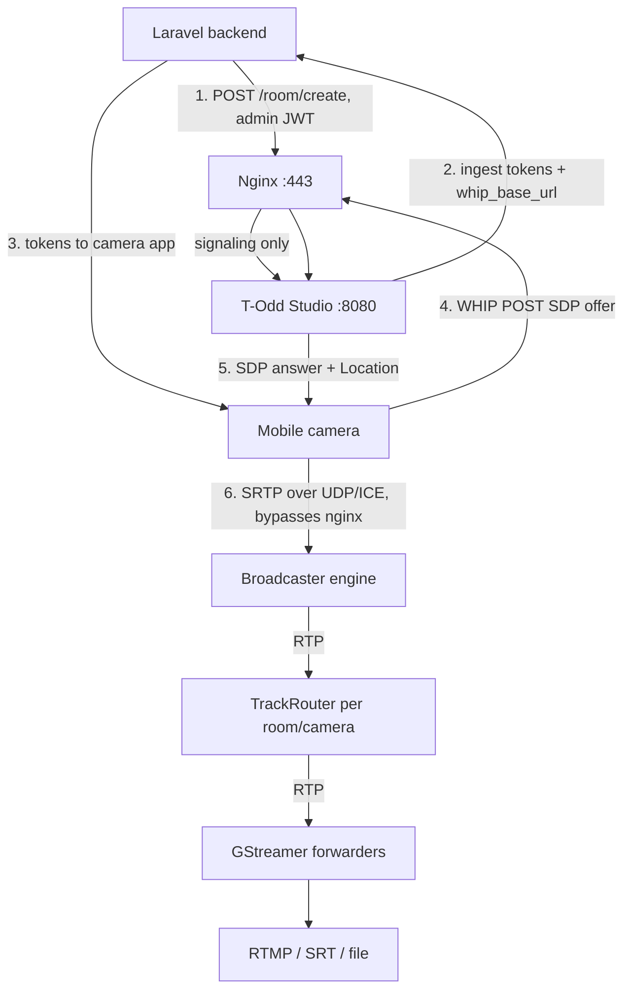

# 01 — T-Odd Media Engine Architecture

> Principal Cloud Architect advisory for running the Rust media engine
> (`todd-signaling` + `todd-sfu`, binaries `todd-studio` +
> `todd-broadcaster`) alongside the Laravel app at
> cricket.traceodd.com — Phase 1 on the same VPS, Phase 2 on a dedicated
> media server.

## 1. Directory & repository strategy

**Decision: keep it in the existing monorepo, as a fully self-contained
workspace at `media-engine/`.**

```
NexaTrace_System/
├── backend/                    # Laravel (untouched)
├── rust/                       # existing Flutter FFI crate (untouched)
├── media-engine/               # ← this project (new, decoupled)
│   ├── Cargo.toml              # workspace manifest + shared deps
│   ├── crates/todd-common/     # auth / config / DTOs
│   ├── crates/todd-signaling/ # Axum control plane (bin `todd-studio`)
│   ├── crates/todd-sfu/       # WHIP/WHEP media plane (bin `todd-broadcaster`)
│   ├── crates/todd-transcode/ # GStreamer pipelines (HW matrix + audio buses)
│   ├── deploy/{nginx,systemd,docker}/
│   └── docs/
└── lib/ android/ ...           # Flutter app (untouched)
```

Rationale:

- You already run a monorepo pattern (Flutter + Laravel + Rust FFI in one
  repo). Adding a fourth, self-contained module is consistent.
- The engine's **only** coupling to Laravel is a shared secret and a URL —
  both env vars. It has its own `Cargo.lock`, Dockerfiles and CI surface,
  so it is decoupled *architecturally* without the operational cost of a
  second repo.
- Extraction path: if a separate team ever owns media, `git filter-repo
  --path media-engine` produces a clean standalone repository in minutes,
  because nothing references outside the folder.

Do **not** merge this with the existing `rust/` crate — that one is
flutter_rust_bridge FFI glue for the Flutter app (a cdylib artifact), a
completely different build and deployment lifecycle.

## 2. Component design

| Component | Role | Runtime |
|---|---|---|
| `todd-signaling` (bin `todd-studio`) | Axum REST API, room registry, token issuance/validation, WHIP/WHEP signaling entry, forwarding control | `tokio` multi-thread runtime |
| `todd-sfu` (embedded) | PeerConnections (webrtc-rs), simulcast track router, PLI forwarding, transcode forwarders | same process (Phase 1) |
| `todd-sfu` (standalone, bin `todd-broadcaster`) | Same engine + own HTTP API on :8081 | own process (Phase 2) |
| Laravel | Business logic, user auth, mints engine JWTs, calls signaling via `MEDIA_ENGINE_URL` | existing app server |

### Media data flow



The architectural invariant: **nginx carries kilobytes of signaling, never
gigabytes of media.** WebRTC media is UDP and flows directly (or via
coturn TURN on 3478/5349 + relay range). This is what makes Laravel and
the media engine coexist on one server without bandwidth contention.

## 3. Authentication & authorization

Primary: **HS256 JWTs with a shared secret**, minted by Laravel
(`firebase/php-jwt`) and verified locally by Rust.

| Claim | Meaning | Example |
|---|---|---|
| `iss` | issuer id | `traceodd` |
| `aud` | audience | `todd-media-engine` |
| `sub` | caller id | `laravel`, user id, camera id |
| `role` | `admin` / `publisher` / `viewer` | |
| `room_id`, `camera_id` | scope (absent for admin) | |
| `exp` / `iat` / `jti` | expiry / issued / nonce | |

Token lifetimes:

- **Admin** (Laravel → Studio, server-to-server): hours; minted on demand
- **Publisher** (camera → WHIP): `INGEST_TOKEN_TTL_SECS=300` (5 min — long
  enough for negotiation + reconnects, short enough to contain leaks)
- **Viewer**: room TTL (1 hour default)

Why not Sanctum directly: Sanctum tokens are opaque strings stored in the
Laravel DB — verifying them from Rust would require a network call per
request, adding milliseconds to the WHIP path. A shared-secret JWT verifies
in microseconds with zero I/O, and works identically across servers
(secret travels via `.env`).

Fallback: if `LARAVEL_INTROSPECTION_URL` is set, tokens that fail JWT
verification are POSTed to Laravel for opaque-token validation (Sanctum).
Useful for browser sessions, but never for the camera ingest path.

## 4. API surface

| Method | Path | Auth | Purpose |
|---|---|---|---|
| POST | `/api/v1/room/create` | admin | create room, mint tokens |
| GET | `/api/v1/room/list` | admin | list rooms |
| GET | `/api/v1/room/{id}` | room-scoped | status + active cameras |
| DELETE | `/api/v1/room/{id}` | admin | teardown room + sessions |
| POST | `/api/v1/room/{id}/forward` | admin | attach RTMP/SRT/file forwarder |
| POST | `/api/v1/whip/ingest/{room}/{camera}` | publisher | WHIP offer → answer |
| DELETE | `/api/v1/whip/session/{id}` | publisher/admin | close session |
| GET | `/healthz` `/readyz` | none | probes |

WHIP clients that cannot set headers may pass `?token=` on the query
string (supported by both services).

## 5. Low-latency engineering decisions

1. **Signaling via plain HTTP/SDP** — no WebSocket handshakes, no extra
   hops; a WHIP ingest is one POST round-trip (~5 ms on loopback).
2. **Local JWT verification** — sub-millisecond, no DB/network dependency
   on the ingest path.
3. **Track router with `try_send` + drop** — backpressure policy: never
   queue media. A dropped packet costs one frame; a queued packet costs
   the stream's latency budget.
4. **GStreamer zerolatency pipelines** — `x264enc tune=zerolatency`,
   `sync=false` sinks, `flvmux streamable=true`; re-encode only when the
   target requires it (RTMP/SRT), never for pass-through routing.
5. **ICE, not relays, when possible** — direct UDP host candidates give
   the lowest RTT; TURN is the fallback for carrier NATs.
6. **Tokio worker threads = physical cores** — the engine is CPU-bound
   during re-encode; don't oversubscribe.
7. **Buffering off at nginx** — `proxy_request_buffering off` so SDP
   offers hit the handler immediately.

## 6. Failure & lifecycle

- **Session pruning**: a PeerConnection state change to `Failed/Closed`
  (network loss, DTLS failure) triggers `prune_dead_sessions()`, which
  releases the session, cancels track pumps, and clears the router.
- **Room expiry**: rooms carry `expires_at`; lazy pruning on reads.
- **Graceful shutdown**: SIGTERM → axum graceful shutdown → sessions
  dropped cleanly.
- **Idempotency**: room create always mints fresh IDs/tokens; forwarder
  attach is idempotent per `(room, camera, url)`.
- **Readiness**: `/readyz` fails if the media plane is unreachable —
  compose/systemd health checks use it.

## 7. Security checklist

- Bind loopback-only in Phase 1 (`STUDIO_HOST=127.0.0.1`); nginx is the
  only public surface.
- `JWT_SECRET` ≥ 64 random chars, identical on Laravel and engine, never
  in git (`.env` is gitignored).
- systemd units: `NoNewPrivileges`, `ProtectSystem=full`, `CPUQuota`,
  `MemoryMax`.
- CORS disabled by default (Phase 1 is same-origin); enable explicitly for
  Phase 2 browser clients.
- No raw SDP/ice details in error responses (errors are redacted).
- TURN credentials: static in the boilerplate; production should use
  coturn REST API auth (see `deploy/docker/coturn.conf` notes).

## 8. Known scope limits of this boilerplate

- Forwarders are **video-only** (first video track wins); audio muxing is
  a documented follow-up.
- `WebRtcViewer` output needs a signaling service + `gst-plugins-rs`
  `webrtcsink`; reserved in the enum.
- Room state storage: in-memory (`DashMap`) by default; a Redis backend
  ships in the box — set `ROOM_STORE=redis` (+ `REDIS_URL`) to share
  room/session state across Studio replicas or hosts.
- webrtc-rs is pinned to **0.17** (the battle-tested API line; see
  `docs/07-sfu-architecture.md`). 0.20+ is a fresh re-architecture —
  evaluate deliberately before migrating.

## 9. CI & local tooling

- `.github/workflows/media-engine.yml` runs fmt/clippy/tests on every
  push to `master` and PR touching `media-engine/**`, plus a Redis-backed
  store smoke test and a GStreamer-featured check on ubuntu-24.04.
- `scripts/dev.ps1` / `scripts/dev.sh` wrap cargo with the platform
  environment fixes (see `docs/05-local-dev-windows.md` for Windows).
