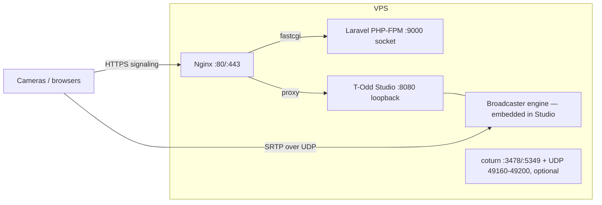

# 02 — Phase 1: Single-Server Coexistence Runbook

Laravel (Nginx + PHP-FPM) and the Rust media engine (Axum + webrtc-rs)
sharing one VPS, with zero port or bandwidth conflicts.

## 1. Topology



Two hard rules:

1. **Rust binds loopback only** (`STUDIO_HOST=127.0.0.1`). The public
   internet can only reach it through nginx, which is already hardened.
2. **Media never transits nginx.** WebRTC media is UDP, nginx is TCP —
   they cannot conflict by construction. The only shared resource is the
   NIC, and signaling traffic is negligible (kilobytes).

## 2. Port budget

| Port | Protocol | Owner | Public? |
|---|---|---|---|
| 80/443 | TCP | nginx (Laravel + media signaling) | yes |
| 8080 | TCP | todd-studio | **loopback only** |
| 8081 | TCP | todd-broadcaster (standalone mode only) | **loopback only** |
| 3478 | TCP/UDP | coturn (optional) | yes |
| 5349 | TCP | coturn TLS (optional) | yes |
| 49160–49200 | UDP | coturn relay (optional) | yes |
| 9000 | unix socket | PHP-FPM | no |

No overlap with Laravel's HTTP/FPM/socket usage, and nothing the engine
needs collides with SRS (RTMP 1935) or Reverb (websockets) if you run
those on the same box.

## 3. Install & run (bare metal)

```bash
# 1. Place the workspace + build (first time needs GStreamer dev libs):
sudo apt install -y libgstreamer1.0-dev libgstreamer-plugins-base1.0-dev \
  gstreamer1.0-plugins-good gstreamer1.0-plugins-bad gstreamer1.0-plugins-ugly \
  gstreamer1.0-libav
sudo mkdir -p /opt/todd-media-engine && sudo chown $USER /opt/todd-media-engine
cp -r media-engine /opt/todd-media-engine
cd /opt/todd-media-engine
cargo build --release --features gst -p todd-signaling

# 2. Config
sudo cp .env.example .env && sudo chown todd:todd .env
#   set JWT_SECRET (openssl rand -base64 48), PUBLIC_BASE_URL,
#   keep STUDIO_HOST=127.0.0.1, MEDIA_PLANE=embedded

# 3. Service user + units
sudo useradd -r -s /usr/sbin/nologin todd
sudo cp deploy/systemd/todd-studio.service /etc/systemd/system/
sudo systemctl daemon-reload && sudo systemctl enable --now todd-studio
journalctl -u todd-studio -f   # watch startup
```

## 4. Nginx routing (pick one or both)

**Option A — subdomain (recommended):** `media.traceodd.com` → Studio.
Cleanest isolation; WHIP URLs are short and readable; TLS is a standard
certbot flow.

```bash
sudo cp deploy/nginx/media-engine.conf /etc/nginx/sites-available/
sudo ln -s /etc/nginx/sites-available/media-engine.conf /etc/nginx/sites-enabled/
sudo certbot --nginx -d media.traceodd.com
sudo nginx -t && sudo systemctl reload nginx
```

**Option B — path prefix on the main domain:** paste
`deploy/nginx/main-domain-snippet.conf` into your existing
cricket.traceodd.com server block, before any `location ~ \.php$` regex.
Laravel keeps owning `/api/v1/*`; `/api/v1/media/*` goes to Rust (the
`/media` prefix is stripped by nginx).

Whichever you choose, Laravel must be told the resulting base URL via
`MEDIA_ENGINE_URL` (see doc 04). Do **not** define Laravel routes under
the proxied prefix.

## 5. Firewall (ufw)

```bash
sudo ufw allow 80/tcp
sudo ufw allow 443/tcp
# only if TURN is enabled (Phase 1 optional):
sudo ufw allow 3478/tcp && sudo ufw allow 3478/udp
sudo ufw allow 5349/tcp
sudo ufw allow 49160:49200/udp
```

Do **not** open 8080/8081 — nothing outside the box needs them.

## 6. Resource separation (example: 4 vCPU / 8 GB)

| Consumer | Budget | Mechanism |
|---|---|---|
| PHP-FPM | 2 workers × 128 MB | `pm.max_children = 2` (media is no longer PHP's job) |
| todd-studio | 200% CPU, 1 GB | `CPUQuota`/`MemoryMax` in the unit |
| coturn | ~50 MB | daemon defaults |
| nginx | negligible | |

The engine scales with `tokio` worker threads (defaults to core count);
re-encoding is the only CPU-heavy stage, and it is bounded by
`x264enc preset=ultrafast`.

## 7. Verify

```bash
curl -s https://media.traceodd.com/healthz        # ok
curl -s https://media.traceodd.com/readyz         # ready

# end-to-end room creation
TOKEN=$(php artisan media:engine:token 2>/dev/null || \
        JWT_SECRET=$JWT_SECRET cargo run -p todd-common --example mint_token -- admin)
curl -s -X POST https://media.traceodd.com/api/v1/room/create \
  -H "Authorization: Bearer $TOKEN" -H "Content-Type: application/json" \
  -d '{"name":"phase1-smoke","camera_ids":["cam-1"]}'
# → 201 with ingest_tokens["cam-1"] and whip_base_url

# WHIP ingest from any WHIP client (OBS 30+, mediamtx, GStreamer webrtcsink):
# POST the SDP offer to {whip_base_url}/cam-1 with the ingest token.
# → 201 + SDP answer; DELETE the Location header to stop.
```

## 8. TURN in Phase 1?

Direct ICE (host candidates) works when cameras are on clean networks
(wifi/office). Cameras on 4G/5G are frequently behind symmetric NAT and
**will fail without TURN**. If any production camera uses mobile data,
deploy coturn now — it's ~50 MB of RAM:

```bash
sudo apt install coturn
sudo cp deploy/docker/coturn.conf /etc/turnserver.conf
sudo systemctl enable --now coturn
# and set in .env:
# TURN_SERVERS=turnuser:turnpass@media.traceodd.com:3478
```
